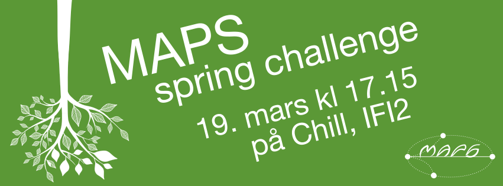

# MAPS Spring Challenge V15
Here be the problems and solutions used in MAPS Spring Challenge V15.

People who have contributed are listed below each problem in no particular
order.

- [Birthday minute](birthday_minute)  
    Håkon Struijk Holmen  
    Carl Martin Rosenberg  
    Leif Harald Karlsen
- [Bit concat](bit_concat)  
    Leif Harald Karlsen  
    Tore Norderud  
    Martin Vonheim Larsen
- [Cellular automata](cellular_automata)  
    Leif Harald Karlsen  
    Tore Norderud  
    Håkon Struijk Holmen
- [Coconuts](coconuts)  
    Carl Martin Rosenberg  
    Ola Liabøtrø
- [Dice](dice)  
    Martin Vonheim Larsen  
    Håkon Struijk Holmen  
    Carl Martin Rosenberg
- [Friday the 13th](friday13)  
    Martin Vonheim Larsen  
    Carl Martin Rosenberg
- [Geeks and nerds](geeks_and_nerds)  
    Carl Martin Rosenberg  
    Håkon Struijk Holmen
- [Image](image)  
    Martin Vonheim Larsen
- [Keywords](keywords)  
    Carl Martin Rosenberg  
    Martin Vonheim Larsen
- [Lines](lines)  
    Martin Vonheim Larsen  
    Ola Liabøtrø
- [Matrix](matrix)  
    Martin Vonheim Larsen  
    Ola Liabøtrø
- [MD5 cracking](md5_crack)  
    Håkon Struijk Holmen  
    Tore Norderud
- [Palindrome trifecta](palin_tri)  
    Martin Vonheim Larsen  
    Carl Martin Rosenberg
- [Points](points)  
    Martin Vonheim Larsen
- [Power](power)  
    Martin Vonheim Larsen  
    Leif Harald Karlsen
- [Scaling circles](scaling_circles)  
    Carl Martin Rosenberg  
    Håkon Struijk Holmen
- [Wordlist](wordlist)  
    Håkon Struijk Holmen  
    Martin Vonheim Larsen
